# ZeroTier & Przewodnik po Modpacku Minecraft

Ten plik README pomoże Ci skonfigurować ZeroTier oraz pobrać modpack "Better MC" dla Minecrafta. Postępuj zgodnie z poniższymi instrukcjami, aby rozpocząć.

## Konfiguracja ZeroTier

1. Pobierz [ZeroTier](https://www.zerotier.com/download/) i zainstaluj na swoim urządzeniu.
2. Po zainstalowaniu uruchom program.
   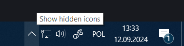
3. Kliknij prawym przyciskiem na ikonę ZeroTier w pasku systemowym i wybierz **Join Network**.
   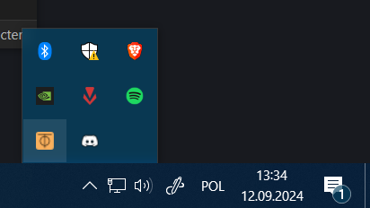
4. Wprowadź 15-znakowy kod sieciowy, który wysłałem Ci prywatnie (nie udostępniaj publicznie!). Po wpisaniu powinieneś być podłączony do sieci.

## Jak pobrać modpack (dla użytkowników premium Minecraft)

1. Pobierz [CurseForge](https://www.curseforge.com/download/app) i zainstaluj.
2. Otwórz CurseForge i wyszukaj `Better MC [FORGE] - BMC4` w sekcji Minecraft.
   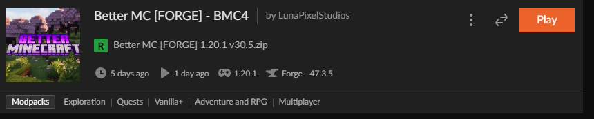
3. **WAŻNE**: Zanim pobierzesz, musisz zmienić wersję modpacka na `30.5`.
   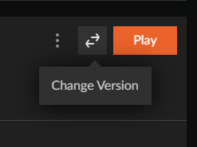
   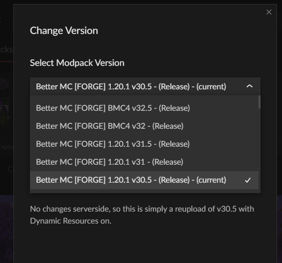
4. Po pobraniu modpacka możesz kliknąć **Play**.

W następnym tutorialu pokażę, jak zmienić ilość przydzielonej pamięci RAM, aby Minecraft działał optymalnie. [Kliknij tutaj](#jak-zmienic-ram-w-minecraft) po więcej szczegółów.

## Jak pobrać modpack (dla użytkowników bez premium Minecraft)

Nie wiem, jak to zrobić dla osób bez premium, więc na razie zostawiam to. Powodzenia i pozdrawiam!

## Jak zmienić RAM w Minecraft (premium lub bez premium)

Aby zwiększyć wydajność Minecrafta, należy zwiększyć ilość przydzielonej pamięci RAM. Oto kroki:

1. Otwórz launcher Minecraft.
2. Przejdź do zakładki **Instalacje**.
   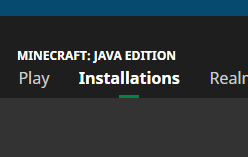
3. Kliknij trzy kropki (**...**) obok swojego profilu i wybierz **Edytuj**.
   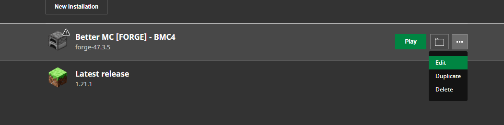
4. Kliknij **Więcej opcji**.
   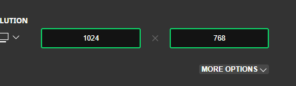
5. Zmień pierwszy argument w sekcji **Argumenty JVM**.
   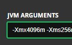

   Zalecane jest ustawienie połowy dostępnej pamięci RAM. Jeśli nie wiesz, ile masz RAM-u, ustaw wartość na `6g` (6GB).

   Na przykład, jeśli masz 16GB RAM-u:
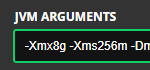

Można to również zmienić bezpośrednio w CurseForge, dzięki czemu nie trzeba tego robić za każdym razem, gdy uruchamiasz Minecrafta.

6. W CurseForge:
- Kliknij trzy kropki obok modpacka
- Wybierz **Profile Options**
- Odznacz pole **Memory Settings**
- Ustaw ile pamięci chcesz przydzielić (1GB = 1024MB). Dla ułatwienia [tutaj jest przelicznik](https://www.gbmb.org/gb-to-mb).
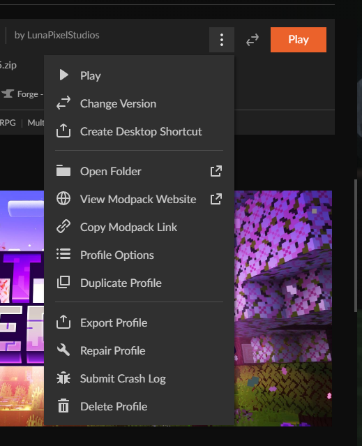
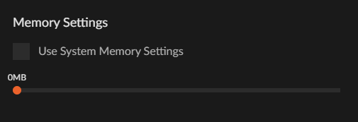
